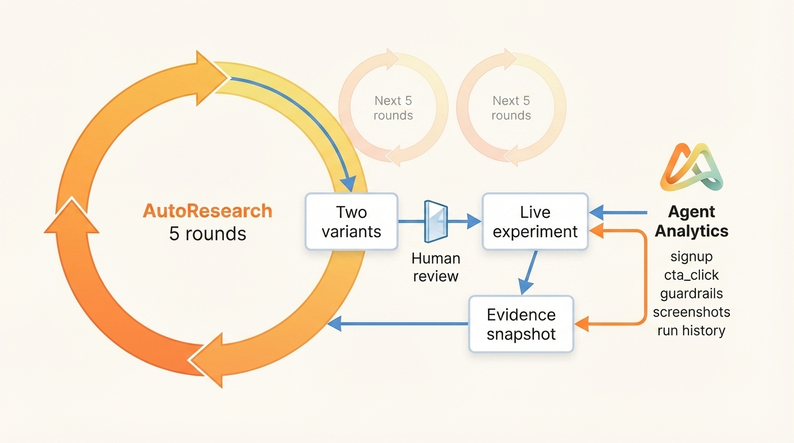
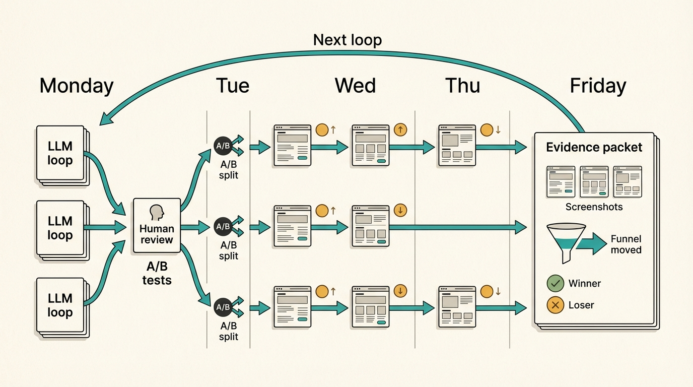

# autoresearch-growth

Autoresearch-style growth loops for landing pages, onboarding copy, pricing pages, and experiment candidates.

<p align="center">
  
</p>

This is a fork of [karpathy/autoresearch](https://github.com/karpathy/autoresearch), adapted for growth work. The idea is a loop on top of the loop: use autoresearch to generate and judge candidates quickly, then use real experiment data to decide what the next autoresearch run should learn from.

A coding agent reads `program.md`, studies your product brief and analytics snapshot, runs critique/revision/judging rounds, then outputs two distinct variants ready to test against the current control.

Read the writeup: [Autoresearch Growth Loops Need Reality Checks](https://blog.agentanalytics.sh/blog/autoresearch-growth-loop-agent-analytics/)

Use any analytics source you want: Agent Analytics, PostHog, GA4, Mixpanel, SQL, CSV exports, product logs, or a hand-written data brief. The loop only needs a clear surface, current control, primary metric, proxy metric, guardrails, and the freshest evidence you can give it.

It works especially well with [Agent Analytics](https://agentanalytics.sh) because agents can pull fresh data through the CLI/API, inspect funnels and events without opening a dashboard, and use experiment data in the next run. If your setup exposes experiment creation through an API, the same loop can move from "generate variants" to "ship, measure, learn, repeat."

This repo is a community template. Bring your own product, your own data, and your own judgment.

## Why This Is Different

Most autoresearch loops optimize against an internal score. This template uses two layers:

1. the inner autoresearch loop for fast candidate generation
2. the outer experiment loop where signup, CTA, and guardrail data feed the next run

LLM judges are a filter. User behavior is the judge.

The waiting period is not a bug. It is the reality check.

<p align="center">
  
</p>

At small scale, wait 24 or 48 hours for real behavior. At bigger scale, run several experiments in parallel and review the week as a batch: what shipped, what won, what lost, what guardrails moved, and what the next loop should try.

The growth fitness function is:

```text
primary event + proxy event + guardrails + product-truth constraints
```

The proxy helps the loop move quickly. The primary event decides whether a shipped experiment actually won. Guardrails keep the loop from buying more clicks by damaging bounce, scroll depth, performance, signup quality, or the product truth.

## The Loop

### Inner Autoresearch Loop

1. Define the surface, audience, control, and fitness function.
2. Pull the latest analytics data for that surface.
3. Generate candidate A.
4. Critique it for genericness, drift, and weak conversion intent.
5. Write candidate B from the critique.
6. Synthesize the strongest parts into AB.
7. Blind-rank A, B, and AB with Borda scoring.
8. Repeat for several rounds.
9. Output two strong variants for review.

### Outer Experiment Loop

1. Let a human review product truth and risk.
2. Ship the approved variants into an A/B test.
3. Wait for real behavior.
4. Pull signup, CTA, and guardrail data back into the next brief.
5. Run the inner loop again from evidence.

## Files

- `program.md` - operating manual for the loop.
- `brief.md` - project brief template.
- `results.tsv` - append-only round log template.
- `final_variants.md` - final output template.

`program.md` defines the exact `results.tsv` header, column meanings, TSV rules, and an example row.

## Quick Start

1. Fill in `brief.md` with the project, surface, control copy, metrics, and data commands.
2. Refresh the latest data snapshot for the project.
3. Start Claude Code, Codex, Cursor, or another coding agent in this repo.
4. Prompt:

```text
Read program.md and run the growth loop. Use brief.md as the source of truth. Produce final_variants.md with two variants for review.
```

## Bring Analytics Data

The loop can use any analytics export or query result. Put the source commands or pasted reports in `brief.md`, then summarize the evidence under `Live Data Snapshot`.

Good inputs include:

- page views, sessions, bounce, scroll depth, and time on page
- funnel steps from entry to CTA to signup, checkout, or activation
- event samples for the primary and proxy metrics
- current or past experiment results
- source, device, quality, retention, or revenue notes when available

## Best With Agent Analytics

[Agent Analytics](https://agentanalytics.sh) is built for this workflow: your agent can query web analytics from the terminal, save a dated snapshot, and feed that evidence into `brief.md`.

You do not need to start with shell commands. Ask your agent for the evidence window you need:

```text
Fetch the last 7 days of analytics for this landing page.
Use signup as the goal and cta_click as the proxy.
Include recent experiment results if they exist.
Summarize what is useful and what is too sparse to trust.
```

If you want a reproducible Agent Analytics snapshot recipe, use [`docs/agent-analytics-snapshot.md`](docs/agent-analytics-snapshot.md).

For private products, keep `brief.md`, `data/`, `results.tsv`, and `final_variants.md` in a private run repo or private fork. The public template should only contain sample or sanitized data.

## Try The Demo

The repo includes a fake SaaS example with sample analytics data and a generated homepage visual:

<p align="center">
  
</p>

```bash
cp examples/demo-saas/brief.md brief.md
cp examples/demo-saas/results.tsv results.tsv
cp examples/demo-saas/final_variants.md final_variants.md
cp -R examples/demo-saas/data data
```

See `examples/demo-saas/README.md` for the fake product context. Then run the quick-start prompt above.

There is also a completed example run:

- [`examples/demo-saas/runs/2026-04-15-e2e/README.md`](examples/demo-saas/runs/2026-04-15-e2e/README.md) - run report
- [`examples/demo-saas/runs/2026-04-15-e2e/results.tsv`](examples/demo-saas/runs/2026-04-15-e2e/results.tsv) - five judged rounds
- [`examples/demo-saas/runs/2026-04-15-e2e/final_variants.md`](examples/demo-saas/runs/2026-04-15-e2e/final_variants.md) - two review-ready winners

Read that first if you want to see what a finished loop should look like.

The demo is intentionally fake; replace it with your own product, control copy, events, and data commands before making real decisions.

## Good First Targets

- Landing-page hero copy.
- Pricing-page positioning.
- Signup/onboarding page copy.
- CTA labels and supporting proof.
- Docs or blog CTAs that lead to signup or activation.

## Metrics

Pick one primary event and use other signals as proxy or guardrails.

Examples:

- Primary: `signup`, proxy: `cta_click`.
- Primary: `checkout`, proxy: `pricing_cta_click`.
- Primary: `project_created`, proxy: `install_command_copied`.
- Primary: `activation_completed`, proxy: `onboarding_step_completed`.

The proxy helps move quickly. The primary event decides real winners.

Treat this as the run's fitness function:

```text
primary_event: the real conversion goal
proxy_event: the faster signal that helps compare candidates
guardrails: signals the loop must not damage
product_truth: claims and positioning constraints that must stay true
```
