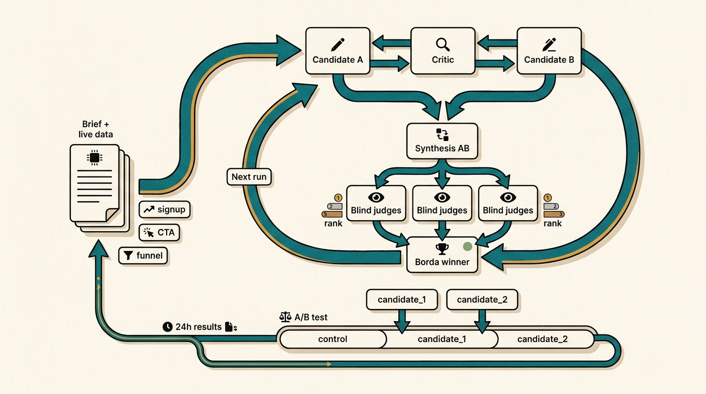
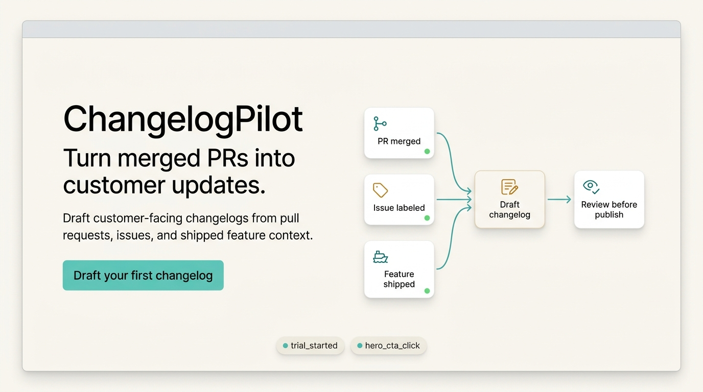

# autoresearch-growth

Autoresearch-style growth loops for landing pages, onboarding copy, pricing pages, and experiment candidates.

<p align="center">
  
</p>

This is a fork of [karpathy/autoresearch](https://github.com/karpathy/autoresearch), adapted for growth work. A coding agent reads `program.md`, studies your product brief and analytics snapshot, runs critique/revision/judging rounds, then outputs two distinct variants ready to test against the current control.

Use any analytics source you want: Agent Analytics, PostHog, GA4, Mixpanel, SQL, CSV exports, product logs, or a hand-written data brief. The loop only needs a clear surface, current control, primary metric, proxy metric, guardrails, and the freshest evidence you can give it.

It works especially well with [Agent Analytics](https://agentanalytics.sh) because agents can pull fresh data through the CLI/API, inspect funnels and events without opening a dashboard, and use experiment data in the next run. If your setup exposes experiment creation through an API, the same loop can move from "generate variants" to "ship, measure, learn, repeat."

This repo is a community template. Bring your own product, your own data, and your own judgment.

## The Loop

1. Define the surface, audience, control, and metric.
2. Pull the latest analytics data for that surface.
3. Generate a candidate.
4. Critique it for genericness, drift, and weak conversion intent.
5. Write a fresh alternative from the critique.
6. Synthesize the strongest parts.
7. Blind-rank the options with Borda scoring.
8. Repeat for several rounds.
9. Ship the two strongest distinct variants into an A/B test.
10. Feed experiment data into the next run.

## Files

- `program.md` - operating manual for the loop.
- `brief.md` - project brief template.
- `results.tsv` - append-only round log template.
- `final_variants.md` - final output template.

`program.md` defines the exact `results.tsv` header, column meanings, TSV rules, and an example row.

## Quick Start

1. Fill in `brief.md` with the project, surface, control copy, metrics, and data commands.
2. Refresh the latest data snapshot for the project.
3. Start Claude Code, Codex, Cursor, or another coding agent in this repo.
4. Prompt:

```text
Read program.md and run the growth loop. Use brief.md as the source of truth. Produce final_variants.md with two variants for review.
```

## Bring Analytics Data

The loop can use any analytics export or query result. Put the source commands or pasted reports in `brief.md`, then summarize the evidence under `Live Data Snapshot`.

Good inputs include:

- page views, sessions, bounce, scroll depth, and time on page
- funnel steps from entry to CTA to signup, checkout, or activation
- event samples for the primary and proxy metrics
- current or past experiment results
- source, device, quality, retention, or revenue notes when available

## Best With Agent Analytics

[Agent Analytics](https://agentanalytics.sh) is built for this workflow: your agent can query live web analytics from the terminal, save a dated snapshot, and feed that evidence into `brief.md`.

`npx` collects the evidence for the run. It does not directly create `results.tsv`; the autoresearch loop creates `results.tsv` as it judges rounds.

The usual flow is:

1. collect a dated 7-day data snapshot
2. summarize the snapshot in `brief.md`
3. initialize `results.tsv` with the header if this is a new run
4. run the agent loop
5. let the loop append one row to `results.tsv` after each judging round

Use placeholders for your own project and events:

```bash
# Run once if this machine or agent runtime is not logged in.
npx @agent-analytics/cli@0.5.11 login

PROJECT_SLUG=my-site
PRIMARY_EVENT=signup
PROXY_EVENT=cta_click
RUN_DATE=$(date +%F)

mkdir -p "data/$RUN_DATE"

# Keep collecting the full snapshot even if one analytics command fails.
# Failed commands write their error output and exit code into the saved file.
run_snapshot_command() {
  output_file="$1"
  shift
  set +e
  "$@" > "$output_file" 2>&1
  command_status=$?
  set -e
  perl -i -pe 's/\e\[[0-9;]*m//g' "$output_file"
  if [ "$command_status" -ne 0 ]; then
    printf '\ncommand_exit_code: %s\n' "$command_status" >> "$output_file"
  fi
}

run_snapshot_command "data/$RUN_DATE/insights.txt" \
  npx @agent-analytics/cli@0.5.11 insights "$PROJECT_SLUG" --period 7d
run_snapshot_command "data/$RUN_DATE/pages.txt" \
  npx @agent-analytics/cli@0.5.11 pages "$PROJECT_SLUG" --since 7d
run_snapshot_command "data/$RUN_DATE/funnel.txt" \
  npx @agent-analytics/cli@0.5.11 funnel "$PROJECT_SLUG" \
  --steps "page_view,$PROXY_EVENT,$PRIMARY_EVENT" \
  --since 7d
run_snapshot_command "data/$RUN_DATE/${PROXY_EVENT}-events.txt" \
  npx @agent-analytics/cli@0.5.11 events "$PROJECT_SLUG" \
  --event "$PROXY_EVENT" \
  --days 7 \
  --limit 50
run_snapshot_command "data/$RUN_DATE/${PRIMARY_EVENT}-events.txt" \
  npx @agent-analytics/cli@0.5.11 events "$PROJECT_SLUG" \
  --event "$PRIMARY_EVENT" \
  --days 7 \
  --limit 50
run_snapshot_command "data/$RUN_DATE/experiments.txt" \
  npx @agent-analytics/cli@0.5.11 experiments list "$PROJECT_SLUG"
```

Then update `brief.md`:

- set the project, surface, current control, primary metric, proxy metric, and guardrails
- paste the same commands into `Analytics Commands Or Data`
- summarize the files under `Live Data Snapshot`
- mention sparse data, auth failures, missing events, or uncertain attribution under `Data limitations`

For a new run, initialize `results.tsv` with only the header:

```bash
printf 'round\tcandidate_a\tcandidate_b\tcandidate_ab\twinner\tborda_a\tborda_b\tborda_ab\tstatus\trationale\n' > results.tsv
```

Then prompt the agent:

```text
Read program.md and brief.md. Use data/<RUN_DATE>/ as the latest 7-day snapshot. Run 5 rounds. Append one row per round to results.tsv and write final_variants.md with two distinct variants.
```

For private products, keep `brief.md`, `data/`, `results.tsv`, and `final_variants.md` in a private run repo or private fork. The public template should only contain sample or sanitized data.

## Try The Demo

The repo includes a fake SaaS example with sample analytics data and a generated homepage visual:

<p align="center">
  
</p>

```bash
cp examples/demo-saas/brief.md brief.md
cp examples/demo-saas/results.tsv results.tsv
cp examples/demo-saas/final_variants.md final_variants.md
cp -R examples/demo-saas/data data
```

See `examples/demo-saas/README.md` for the fake product context. Then run the quick-start prompt above.

The demo is intentionally fake; replace it with your own product, control copy, events, and data commands before making real decisions.

## Good First Targets

- Landing-page hero copy.
- Pricing-page positioning.
- Signup/onboarding page copy.
- CTA labels and supporting proof.
- Docs or blog CTAs that lead to signup or activation.

## Metrics

Pick one primary event and use other signals as proxy or guardrails.

Examples:

- Primary: `signup`, proxy: `cta_click`.
- Primary: `checkout`, proxy: `pricing_cta_click`.
- Primary: `project_created`, proxy: `install_command_copied`.
- Primary: `activation_completed`, proxy: `onboarding_step_completed`.

The proxy helps move quickly. The primary event decides real winners.
